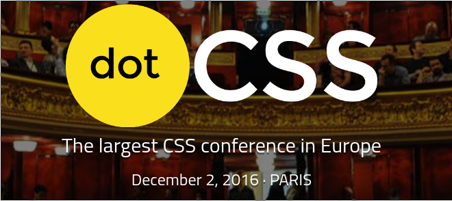

# Meetup #5 (04 juillet 2016)

[Slides d'introduction](http://slides.com/siegfriedehret/css-paris-05)

## 10 astuces SVG qui vont vous sauver la vie

- Par [Vincent De Oliveira](https://twitter.com/iamvdo)
- [Les slides](http://slides.iamvdo.me/kiwiparty16/)

## La technique des «Fab Four»

- Par [Rémi Parmentier](https://twitter.com/HTeuMeuLeu)
- [L'article](http://emails.hteumeuleu.fr/2016/02/fab-four-emails-responsive-sans-media-queries/)

## Tout sur la Web Animation Performance

- Par [Freddy Harris](https://twitter.com/HarrisFreddy)
- [Les slides sur la Web Animation Performance](https://freddy03h.github.io/render-presentation) (et [la vidéo à Best of Web](https://www.youtube.com/watch?v=qrbbD-1ET14))
- [Les slides sur la technique FLIP](https://freddy03h.github.io/flip-presentation/)

## Une dernière chose

Nous sommes partenaires de [dotCSS](http://www.dotcss.io).

:gift_heart: Cliquez sur [ce lien](https://dotcss2016.eventbrite.com/?discount=CSSPARIS) pour bénéficier d'un tarif sympa !

## Remerciements:

- [ekino](http://www.ekino.com) pour l'accueil et le repas
- Tout le monde, merci d'avoir été là !

A bientôt !
