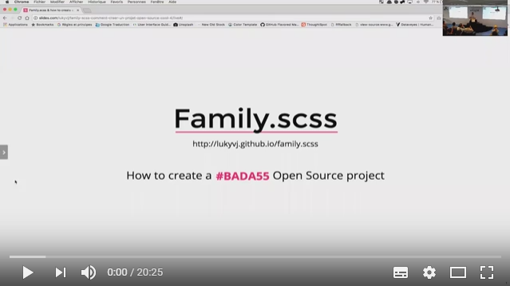
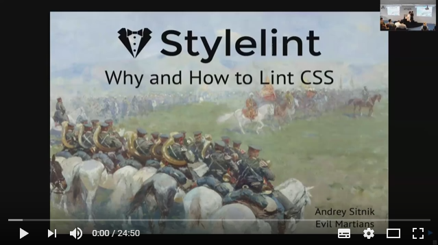
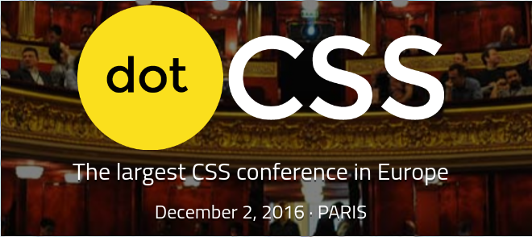

# Meetup #6 (26 octobre 2016)

[Slides d'introduction](http://slides.com/iamvdo/css-paris-6)

## Family.scss & how to create successful open source projects

- Par [Lucas Bonomi](https://twitter.com/LukyVJ)
- [Les slides](http://slides.com/lukyvj/family-scss-comment-creer-un-projet-open-source-cool-4#/)
- [La vidéo](https://www.youtube.com/watch?v=Slk_T4ap2AA)

## Stylelint: why and how you should lint CSS too

- Par [Andrey Sitnik](https://twitter.com/andreysitnik)
- [Les slides](http://slides.com/ai/stylelint#/)
- [La vidéo](https://www.youtube.com/watch?v=QQSj2WX6_I4)

## Une dernière chose

Nous sommes partenaires de [dotCSS](http://www.dotcss.io).

:gift_heart: Cliquez sur [ce lien](https://dotcss2016.eventbrite.com/?discount=CSSPARIS) pour bénéficier d'un tarif sympa !

## Remerciements:

- [Algolia](http://www.algolia.com) pour l'accueil et le repas
- Tout le monde, merci d'avoir été là !

A bientôt !
