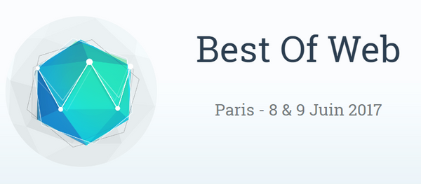
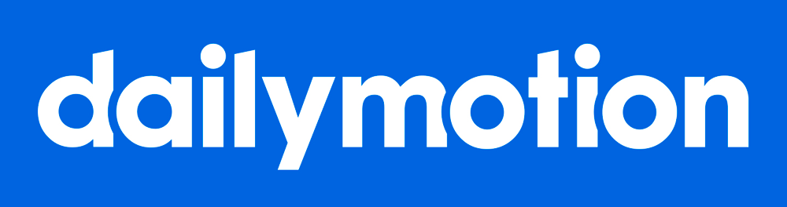

# Meetup #7 (22 mai 2017)

[Slides d'introduction](http://slides.com/siegfriedehret/css-paris-07)

<iframe frameborder="0" width="480" height="270" src="//www.dailymotion.com/embed/video/x5ne8fu" allowfullscreen></iframe> <a href="http://www.dailymotion.com/video/x5ne8fu_css-paris-7-dailymotion-hq-17_tech" target="_blank">CSS Paris #7 @Dailymotion HQ (17)</a> <i>par <a href="http://www.dailymotion.com/DailymotionEng" target="_blank">DailymotionEng</a></i>

## Confs

### Best of Web

Nous sommes partenaires de la conférence [Best of Web](http://bestofweb.paris/). C'est aujourd'hui complet, il reste quelques places pour les formations (:warning: il faut un ticket conférence pour vous inscrire !). C'est [par ici](https://checkout.eventlama.com/#/events/best-of-web-2017/tickets) pour acheter un ticket formation.

### dotCSS

Nous sommes de nouveau partenaires de [dotCSS](http://www.dotcss.io).

- :gift_heart: [ce lien](https://dotcss2017.eventbrite.fr/?discount=CSSPARIS) vous permet de bénéficier de 20% de réduction
- :memo: et envoyez vos propositions au [Call for Paper des Lightning Talks](https://dotcss.io/lt)

## Design d'Interface Utilisateur & bonnes pratiques: règles de base et cas pratiques (15-20') 
   
- Par [Laurent Sébire](https://twitter.com/_TiTAN)

## Scampi - Retour d'expérience sur la construction d'un framework CSS (15-20')
   
- Par [Hugues Moreno](https://twitter.com/funkymaki) et [Anne Cavalier](https://twitter.com/annecav_pidila)
- [gitlab/Scampi](https://gitlab.com/pidila/scampi)
- [Les slides](https://docs.google.com/presentation/d/1m_F8hX-yc7qFRlMw6ZBC-HxbjWjVpLbkOdjcF6SNCqY/edit?ts=5923026d)

## Ceci n'est pas une blague : comment faire un moteur de recherche en pur CSS ? (30') 
   
- Par [Tim Carry](https://twitter.com/pixelastic)
- [Le projet](https://community.algolia.com/algoliasearch-client-css/)

## How to create "non-rectangular" headers

- Par [Lucas Bonomi](https://twitter.com/LukyVJ)
- [Les slides](http://slides.com/lukyvj/reussir-vos-headers-non-rectangulaire#/)

## Remerciements:

Un grand merci à tous les gens qui sont venus !

On remercie [Dailymotion](https://www.dailymotion.com/fr) et plus particulièrement [Claudia](https://twitter.com/koste4/)

A bientôt !
